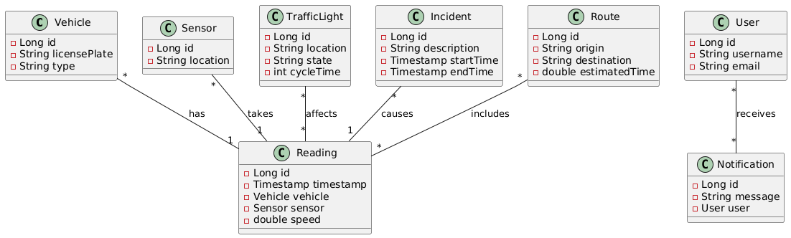

# Smart-Traffic - Sistema Inteligente de Gestão de Tráfego

## Descrição
O Smart-Traffic é um sistema back-end desenvolvido em Java com o objetivo de otimizar o fluxo de veículos em áreas urbanas. Através da coleta e análise de dados de tráfego em tempo real, o sistema é capaz de identificar padrões, prever congestionamentos e tomar decisões estratégicas para melhorar a mobilidade urbana.

## Objetivos
* **Coleta de dados:** Integrar o sistema com sensores de tráfego para coletar informações sobre o fluxo de veículos, velocidade, e outros parâmetros relevantes.
* **Análise de dados:** Aplicar técnicas de análise de dados para identificar padrões, tendências e anomalias no tráfego.
* **Otimização do tráfego:** Utilizar os dados analisados para tomar decisões estratégicas, como ajustar os tempos dos semáforos ou sugerir rotas alternativas.

## Funcionalidades
* **Coleta de dados:** Recebe dados de diversos sensores de tráfego, como câmeras e detectores de veículos.
* **Armazenamento de dados:** Armazena os dados coletados em um banco de dados relacional.
* **Análise de dados:** Realiza análises estatísticas e aplica modelos de machine learning para identificar padrões e tendências no tráfego.
* **Geração de relatórios:** Gera relatórios personalizados com informações sobre o fluxo de tráfego, congestionamentos e incidentes.

## Diagrama de Classes

### Descrição das Classes

| Classe | Responsabilidade | Atributos | Métodos |
|---|---|---|---|
| Vehicle | Representa um veículo. | id, licensePlate, type |  |
| Sensor | Representa um sensor de tráfego. | id, location | collectData() |
| Reading | Representa uma leitura realizada por um sensor. | id, timestamp, vehicle, sensor, speed | calculateAverageSpeed() |
| TrafficLight | Representa um semáforo. | id, location, state, cycleTime | changeState() |
| Incident | Representa um incidente no trânsito. | id, description, startTime, endTime | isOngoing() |
| Route | Representa uma rota entre dois pontos. | id, origin, destination, estimatedTime | calculateDistance() |
| User | Representa um usuário do sistema. | id, username, email | register(), login() |
| Notification | Representa uma notificação enviada ao usuário. | id, message, user | sendNotification() |

#### Explicações Detalhadas

* **Vehicle:**
    * **id:** Identificador único do veículo.
    * **licensePlate:** Placa do veículo.
    * **type:** Tipo do veículo (carro, moto, ônibus, etc.).

* **Sensor:**
    * **collectData():** Coleta dados do sensor e cria um objeto Reading.

* **Reading:**
    * **id:** Identificador único da leitura.
    * **timestamp:** Data e hora da leitura.
    * **vehicle:** Referência ao veículo envolvido na leitura.
    * **sensor:** Referência ao sensor que realizou a leitura.
    * **speed:** Velocidade média registrada na leitura.
    **calculateAverageSpeed():** Calcula a velocidade média com base nos dados brutos.

* **TrafficLight:**
  * **changeState():** Altera o estado do semáforo (vermelho, amarelo, verde).

* **Incident:**
    * **isOngoing():** Verifica se o incidente está em andamento.
  
* **Route:**
    * **calculateDistance():** Calcula a distância entre o ponto de origem e o destino.

* **User:**
    * **register():** Registra um novo usuário no sistema.
    * **login():** Autentica um usuário existente no sistema.

* **Notification:**
    * **sendNotification():** Envia uma notificação para o usuário.

**Relações entre as classes:**
* Um veículo pode estar associado a várias leituras.
* Um sensor pode realizar várias leituras.
* Um semáforo pode afetar várias leituras (por exemplo, alterando a velocidade dos veículos).
* Um incidente pode causar várias leituras com velocidades reduzidas.
* Uma rota pode incluir várias leituras.
* Um usuário pode receber várias notificações.

## Tecnologias Utilizadas
* **Back-end:** Java, Spring Boot, Hibernate
* **Banco de dados:** Oracle
* **Outras:** Docker

## Pré-requisitos
* **Java:** JDK (Java Development Kit)
* **Maven:** Ferramenta de gerenciamento de dependências
* **Docker:** Para containerização (opcional)
* **Um banco de dados Oracle:** Configurado e rodando

## Autores
* **Mariana Spinola** - Desenvolvedora

**Desenvolvido para a disciplina de Java Advanced da FIAP - 2024**
**Curso de Análise e Desenvolvimento de Software**